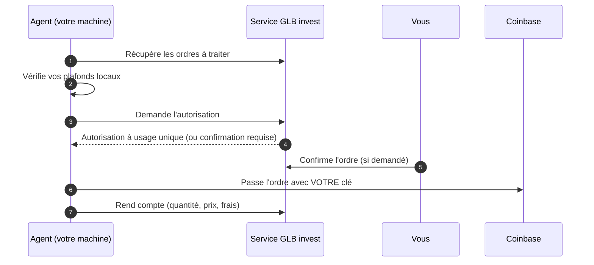

<div align="center">

# GLB invest Agent

**Passe vos ordres GLB invest depuis votre propre ordinateur, avec votre propre clé Coinbase.**
Votre clé ne quitte jamais votre machine. L'agent ne peut pas retirer de fonds et ne dépasse jamais les plafonds que vous fixez.
Le code est ouvert : vous pouvez en vérifier chaque ligne.

[](https://github.com/shineminder/agent-auto-market/releases)
[](https://github.com/shineminder/agent-auto-market/actions)
[](LICENSE)


[Installer](#installer) | [Sécurité](#sécurité) | [Mises à jour](#mises-à-jour) | [Vérifier une release](#vérifier-une-release) | [Signaler une faille](SECURITY.md) | [English](README.md)

</div>

> [!IMPORTANT]
> L'agent **ne prend aucune décision d'investissement**. Il exécute uniquement les ordres que le service GLB invest a autorisés, dans les plafonds que **vous** fixez sur **votre** machine, avec **votre** clé Coinbase, qui ne quitte jamais votre appareil.

## En bref

| | |
|---|---|
| **Votre clé reste chez vous** | Chiffrée sur votre machine, jamais envoyée au service. |
| **Double verrou** | Le service autorise chaque ordre ; l'agent refuse en plus tout ce qui dépasse **vos** plafonds locaux. |
| **Vous gardez la main** | Confirmation possible de chaque ordre sur le site ; révocation immédiate depuis la page Mes accès. |
| **Connexions sortantes uniquement** | Aucun port ouvert. Fonctionne derrière n'importe quelle box ou pare-feu. |
| **Releases signées** | Chaque version est signée et vérifiée avant installation, y compris lors des mises à jour automatiques. |
| **Code ouvert, aucune télémétrie cachée** | Tout ce que fait l'agent est lisible ici. |

## Comment ça marche



- En mode **simulation**, l'agent ne passe aucun ordre.
- Une autorisation ne sert **qu'une fois**, pendant quelques minutes, et pour le montant autorisé.

## Installer

### Avant de commencer (5 minutes)

1. **Créez une clé d'API Coinbase** (Paramètres > API) :
   - droits : **Consulter** et **Négocier** uniquement, **jamais Transférer** ;
   - algorithme : **ECDSA** (ES256) ;
   - sur un serveur, limitez la clé à **l'adresse IP du serveur** ;
   - idéalement, utilisez un **portefeuille dédié**, alimenté du seul montant destiné à l'agent ;
   - téléchargez le fichier `cdp_api_key.json`.
2. **Ouvrez la page Mes accès** de votre site GLB invest et générez un code d'appairage (valable **10 minutes**).
   La page affiche votre **commande d'installation prête à copier**, avec l'adresse de votre site et le code déjà remplis.

### Le plus simple : l'installateur guidé

**Windows** : téléchargez [installer.bat](https://github.com/shineminder/agent-auto-market/releases/latest/download/installer.bat), laissez votre `cdp_api_key.json` dans le dossier Téléchargements, puis double-cliquez sur `installer.bat`.
Il demande l'adresse de votre site et le code d'appairage, installe tout, puis supprime le fichier de clé une fois la clé rangée en sécurité.

> [!NOTE]
> Windows peut afficher « Windows a protégé votre ordinateur » pour un script téléchargé : cliquez sur **Informations complémentaires**, puis **Exécuter quand même**.
> Vous pouvez d'abord vérifier le fichier avec `SHA256SUMS` (voir [Vérifier une release](#vérifier-une-release)).

**Linux** : dans un terminal :

```bash
curl -fsSLO https://github.com/shineminder/agent-auto-market/releases/latest/download/installer.sh && bash installer.sh
```

Il demande l'adresse de votre site et le code d'appairage, et trouve `cdp_api_key.json` dans votre dossier de téléchargements.

### Installation manuelle (une commande)

Les commandes ci-dessous utilisent `https://votre-site` et `ABCD-EFGH` comme exemples.

**Windows 10 / 11** : ouvrez **PowerShell** et collez :

```powershell
irm https://github.com/shineminder/agent-auto-market/releases/latest/download/install.ps1 -OutFile $env:TEMP\cc-install.ps1; powershell -ExecutionPolicy Bypass -File $env:TEMP\cc-install.ps1 -Serveur https://votre-site -Code ABCD-EFGH -CleCoinbase "$env:USERPROFILE\Downloads\cdp_api_key.json" -SupprimerFichierCle
```

Windows demande une seule fois l'autorisation administrateur. L'agent est installé comme **service** et démarre avec Windows.

**Linux (PC ou serveur)** :

```bash
curl -fsSL https://github.com/shineminder/agent-auto-market/releases/latest/download/install.sh | sudo bash -s -- --server https://votre-site --code ABCD-EFGH --key ~/cdp_api_key.json
```

Debian, Ubuntu, Fedora, RHEL et dérivés, en x64 et ARM64. L'agent tourne comme service **systemd** durci.

### Serveur en une étape (cloud-init)

À coller dans le champ « user data » lors de la création d'un serveur Linux **à votre nom** :

```yaml
#cloud-config
runcmd:
  - curl -fsSL https://github.com/shineminder/agent-auto-market/releases/latest/download/install.sh -o /root/cc-install.sh
  - bash /root/cc-install.sh --server https://votre-site --code ABCD-EFGH --os-updates
```

Ajoutez ensuite la clé Coinbase **après** le démarrage, par SSH (jamais dans « user data », que l'hébergeur conserve) :

```bash
sudo bash /root/cc-install.sh --key /chemin/vers/cdp_api_key.json && shred -u /chemin/vers/cdp_api_key.json
```

> [!TIP]
> `--os-updates` active les mises à jour de sécurité automatiques du système (Debian/Ubuntu). Recommandé sur un serveur dédié à l'agent.

## Commandes

Windows : `& "C:\Program Files\CryptoCryptAgent\cc-agent.exe" <commande>` dans un PowerShell administrateur.
Linux : `sudo -u ccagent cc-agent <commande>`.

| Commande | Effet |
|---|---|
| `status` | Appairage, clé, plafonds, ordres en cours, version cible. |
| `verify` | Contrôle complet : site joint, clé acceptée par Coinbase. |
| `limits --order 100 --month 500` | Modifie vos plafonds locaux (en USD). |
| `limits --assets BTC,ETH` | Actifs autorisés sur cette machine. |
| `limits --auto-update false` | Désactive les mises à jour automatiques. |
| `update` | Installe la version demandée par le service (si plus récente et signée). |
| `server --url https://nouveau-site` | Change l'adresse du site, sans nouvel appairage. |
| `pair --code XXXX-XXXX --server https://votre-site` | Réappaire la machine. |
| `key --file cdp_api_key.json` | Remplace la clé Coinbase (vérifiée avant enregistrement). |
| `version` / `help` | Version / aide. |

## Plafonds locaux

Fixés sur **votre** machine et appliqués **avant** toute demande au service :

- **montant maximal par ordre** (100 USD par défaut) ;
- **montant maximal par mois** (500 USD par défaut) ;
- **actifs autorisés** : fixés au premier contact, puis modifiables uniquement en local.

Même un service compromis ne peut pas les dépasser.

## Mises à jour

- L'administrateur du service peut demander une version à **tous** les agents ou à **une seule** machine (pour valider un correctif avant de le généraliser).
- L'agent la télécharge **uniquement depuis les releases de ce dépôt**, vérifie la **signature** puis l'**empreinte**, se remplace et redémarre.
- Il n'installe **jamais une version plus ancienne** de lui-même : un retour en arrière exige `update --version X.Y.Z --allow-downgrade` sur la machine.
- Vous pouvez tout désactiver : `limits --auto-update false`.

L'agent ne met pas à jour votre système d'exploitation. Le service affiche la version du système déclarée par chaque agent, pour repérer les machines à mettre à jour.

## Sécurité

| Sujet | Mesure |
|---|---|
| Clé Coinbase | Windows : chiffrée par la protection des données Windows, dans un dossier réservé au compte du service. Linux : fichier `0600` du seul utilisateur `ccagent`. Jamais journalisée, jamais transmise. |
| Privilèges | Windows : compte de service virtuel `NT SERVICE\CryptoCryptAgent`. Linux : utilisateur système sans shell, service systemd durci (`NoNewPrivileges`, `ProtectSystem=strict`, `PrivateTmp`...). |
| Réseau | Connexions **sortantes** en HTTPS uniquement : votre site GLB invest, `api.coinbase.com`, `github.com` (mises à jour). |
| Autorisation | Chaque ordre exige une autorisation à usage unique ; ce qui a été exécuté est comparé à ce qui a été autorisé (action, actif, montant). |
| Reprise après incident | Un ordre dont l'issue est inconnue n'est **jamais** renvoyé automatiquement : pas de double achat. |
| Chaîne de publication | Releases signées (ECDSA P-256), empreintes SHA-256, attestation de provenance GitHub. |

**Données envoyées au service** : version de l'agent, description du système (ex. `Microsoft Windows 10.0.22631 (X64)`), nom de la machine à l'appairage, présence d'une clé Coinbase (oui ou non, jamais la clé elle-même), résultats des ordres (quantité, prix, frais). **Rien d'autre.**

Une faille ? Voir [SECURITY.md](SECURITY.md). **N'ouvrez pas de ticket public.**

## Vérifier une release

```bash
curl -fsSLO https://github.com/shineminder/agent-auto-market/releases/download/vX.Y.Z/SHA256SUMS
curl -fsSLO https://github.com/shineminder/agent-auto-market/releases/download/vX.Y.Z/SHA256SUMS.sig
openssl dgst -sha256 -verify keys/release-public.pem -signature SHA256SUMS.sig SHA256SUMS
sha256sum --ignore-missing -c SHA256SUMS
gh attestation verify cc-agent-linux-x64 --repo shineminder/agent-auto-market
```

## Compiler depuis les sources

Prérequis : le [SDK .NET 10](https://dotnet.microsoft.com/download). La compilation native demande aussi Visual Studio Build Tools (C++) sous Windows, `clang` et `zlib1g-dev` sous Linux.

```bash
dotnet publish src/Agent/Agent.csproj -c Release -r linux-x64 -o out   # ou win-x64
```

## Désinstaller

- Windows : `install\uninstall.ps1` (en administrateur).
- Linux : `sudo bash install/uninstall.sh`.

Pensez aussi à **révoquer l'appareil** sur la page Mes accès du site et à **supprimer la clé** chez Coinbase.

## FAQ

<details><summary><b>L'agent peut-il retirer mes fonds ?</b></summary>

Non. Il ne fait que consulter les comptes et passer des ordres. Créez la clé **sans** le droit « Transférer » : même volée, elle ne permettrait aucun retrait.
</details>

<details><summary><b>Mon ordinateur doit-il rester allumé ?</b></summary>

Oui, pour que l'agent traite les ordres. Un ordre non traité à temps expire. Pour un agent toujours actif, installez-le sur un petit serveur Linux.
</details>

<details><summary><b>Que se passe-t-il si le service GLB invest est piraté ?</b></summary>

Il ne peut ni obtenir votre clé, ni dépasser vos plafonds locaux, ni installer un agent non signé. Vous pouvez révoquer l'appareil et arrêter le service à tout moment.
</details>

<details><summary><b>Le site a changé d'adresse et mon agent ne se connecte plus.</b></summary>

Normalement, rien à faire : l'agent suit la nouvelle adresse tout seul. Si votre machine est restée éteinte longtemps, lancez une fois : `cc-agent server --url https://nouvelle-adresse`
</details>

<details><summary><b>Mon antivirus bloque le programme.</b></summary>

Vérifiez la release (voir plus haut). Si la signature et l'empreinte sont correctes, signalez un faux positif à l'éditeur de votre antivirus et ouvrez un ticket ici.
</details>

## Normes

Le projet s'aligne sur [NIST SSDF (SP 800-218)](https://csrc.nist.gov/pubs/sp/800/218/final) pour le développement, [SLSA](https://slsa.dev) pour la provenance des builds, [OWASP ASVS](https://owasp.org/www-project-application-security-verification-standard/) pour l'API, et les recommandations [OpenSSF](https://openssf.org). Il ne revendique aucune certification.

## Contribuer

Voir [CONTRIBUTING.md](CONTRIBUTING.md). Contrat de l'API : [docs/API.md](docs/API.md).

## Licence

[MIT](LICENSE)
