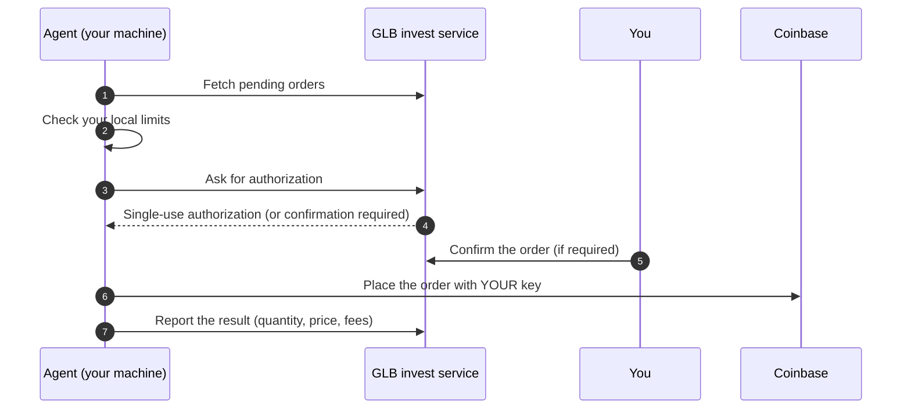

<div align="center">

# GLB invest Agent

**Places your GLB invest trades from your own computer, with your own Coinbase key.**
Your key never leaves your machine. The agent cannot withdraw funds and never goes past the limits you set.
The code is open, so you can check every line.

[](https://github.com/shineminder/agent-auto-market/releases)
[](https://github.com/shineminder/agent-auto-market/actions)
[](LICENSE)


[Install](#install) | [Security](#security) | [Updates](#updates) | [Verify a release](#verify-a-release) | [Report a vulnerability](SECURITY.md) | [Français](README.fr.md)

</div>

> [!IMPORTANT]
> The agent **makes no investment decisions**. It only executes orders that the GLB invest service has authorized, within limits **you** set on **your** machine, using **your** Coinbase key, which never leaves your device.

## At a glance

| | |
|---|---|
| **Your key stays with you** | Stored encrypted on your machine, never sent to the service. |
| **Two locks** | The service authorizes every order; the agent also refuses anything above **your** local limits. |
| **You stay in control** | Optional confirmation of each order on the site; instant revocation from the Access page. |
| **Outbound connections only** | No open port. Works behind any router or firewall. |
| **Signed releases** | Every version is signed and verified before installation, including automatic updates. |
| **Open code, no hidden telemetry** | Everything the agent does is readable here. |

## How it works



- In **simulation** mode, the agent places no order at all.
- An authorization can be used **once**, for a few minutes, and only for the authorized amount.

## Install

### Before you start (5 minutes)

1. **Create a Coinbase API key** (Settings > API):
   - permissions: **View** and **Trade** only, **never Transfer**;
   - algorithm: **ECDSA** (ES256);
   - on a server, restrict the key to **the server IP address**;
   - ideally, use a **dedicated portfolio** funded only with the amount meant for the agent;
   - download the `cdp_api_key.json` file.
2. **Open the Access page** of your GLB invest site and generate a pairing code (valid for **10 minutes**).
   The page shows your **ready-to-copy install command**, with your site address and code already filled in.

The commands below use `https://your-site` and `ABCD-EFGH` as placeholders.

### Easiest: guided installer

**Windows**: download [installer.bat](https://github.com/shineminder/agent-auto-market/releases/latest/download/installer.bat), leave your `cdp_api_key.json` in your Downloads folder, then double-click `installer.bat`.
It asks for your site address and pairing code, installs everything, and deletes the key file once the key is safely stored.

> [!NOTE]
> Windows may show "Windows protected your PC" for a downloaded script: click **More info**, then **Run anyway**.
> You can first check the file against `SHA256SUMS` (see [Verify a release](#verify-a-release)).

**Linux**: in a terminal:

```bash
curl -fsSLO https://github.com/shineminder/agent-auto-market/releases/latest/download/installer.sh && bash installer.sh
```

It asks for your site address and pairing code, and finds `cdp_api_key.json` in your Downloads folder.

### Manual install (one command)

### Windows 10 / 11

Open **PowerShell** and paste:

```powershell
irm https://github.com/shineminder/agent-auto-market/releases/latest/download/install.ps1 -OutFile $env:TEMP\cc-install.ps1; powershell -ExecutionPolicy Bypass -File $env:TEMP\cc-install.ps1 -Serveur https://your-site -Code ABCD-EFGH -CleCoinbase "$env:USERPROFILE\Downloads\cdp_api_key.json" -SupprimerFichierCle
```

Windows asks for administrator approval once. The agent is installed as a **service** and starts with Windows.

### Linux (PC or server)

```bash
curl -fsSL https://github.com/shineminder/agent-auto-market/releases/latest/download/install.sh | sudo bash -s -- --server https://your-site --code ABCD-EFGH --key ~/cdp_api_key.json
```

Debian, Ubuntu, Fedora, RHEL and derivatives, x64 and ARM64. The agent runs as a hardened **systemd** service.

### Server in one step (cloud-init)

Paste into the "user data" field when creating a Linux server **in your own name**:

```yaml
#cloud-config
runcmd:
  - curl -fsSL https://github.com/shineminder/agent-auto-market/releases/latest/download/install.sh -o /root/cc-install.sh
  - bash /root/cc-install.sh --server https://your-site --code ABCD-EFGH --os-updates
```

Then add the Coinbase key **after** boot, over SSH (never in "user data", which the host keeps):

```bash
sudo bash /root/cc-install.sh --key /path/to/cdp_api_key.json && shred -u /path/to/cdp_api_key.json
```

> [!TIP]
> `--os-updates` turns on automatic security updates for the operating system (Debian/Ubuntu). Recommended on a server dedicated to the agent.

## Commands

Windows: `& "C:\Program Files\CryptoCryptAgent\cc-agent.exe" <command>` in an administrator PowerShell.
Linux: `sudo -u ccagent cc-agent <command>`.

| Command | What it does |
|---|---|
| `status` | Pairing, key, limits, pending orders, target version. |
| `verify` | Full check: site reachable, key accepted by Coinbase. |
| `limits --order 100 --month 500` | Changes your local limits (USD). |
| `limits --assets BTC,ETH` | Assets allowed on this machine. |
| `limits --auto-update false` | Turns automatic updates off. |
| `update` | Installs the version requested by the service (only if newer and signed). |
| `server --url https://new-site` | Changes the site address, without pairing again. |
| `pair --code XXXX-XXXX --server https://your-site` | Pairs the machine again. |
| `key --file cdp_api_key.json` | Replaces the Coinbase key (checked before saving). |
| `version` / `help` | Version / help. |

## Local limits

Set on **your** machine and applied **before** any request to the service:

- **maximum per order** (100 USD by default);
- **maximum per month** (500 USD by default);
- **allowed assets**: set on first contact, then changeable locally only.

Even a compromised service cannot go past them.

## Updates

- The service administrator can request a version for **all** agents or for **one** machine (to test a fix before rolling it out).
- The agent downloads it **only from this repository's releases**, checks the **signature** and the **checksum**, replaces itself and restarts.
- It **never installs an older version** on its own: rolling back requires `update --version X.Y.Z --allow-downgrade` on the machine.
- You can turn it all off: `limits --auto-update false`.

The agent does not update your operating system. The service shows the system version each agent reports, to spot machines that need updates.

## Security

| Topic | How |
|---|---|
| Coinbase key | Windows: encrypted with Windows data protection, in a folder restricted to the service account. Linux: `0600` file owned by the `ccagent` user only. Never logged, never transmitted. |
| Privileges | Windows: virtual service account `NT SERVICE\CryptoCryptAgent`. Linux: system user without a shell, hardened systemd unit (`NoNewPrivileges`, `ProtectSystem=strict`, `PrivateTmp`...). |
| Network | **Outbound** HTTPS only: your GLB invest site, `api.coinbase.com`, `github.com` (updates). |
| Authorization | Every order needs a single-use authorization; what was executed is compared with what was authorized (action, asset, amount). |
| Recovery | An order whose outcome is unknown is **never** sent again automatically: no double buy. |
| Release chain | Signed releases (ECDSA P-256), SHA-256 checksums, GitHub build provenance. |

**Data sent to the service**: agent version, system description (e.g. `Microsoft Windows 10.0.22631 (X64)`), machine name at pairing, whether a Coinbase key is configured (yes/no, never the key itself), order results (quantity, price, fees). **Nothing else.**

Found a vulnerability? See [SECURITY.md](SECURITY.md). **Do not open a public issue.**

## Verify a release

```bash
curl -fsSLO https://github.com/shineminder/agent-auto-market/releases/download/vX.Y.Z/SHA256SUMS
curl -fsSLO https://github.com/shineminder/agent-auto-market/releases/download/vX.Y.Z/SHA256SUMS.sig
openssl dgst -sha256 -verify keys/release-public.pem -signature SHA256SUMS.sig SHA256SUMS
sha256sum --ignore-missing -c SHA256SUMS
gh attestation verify cc-agent-linux-x64 --repo shineminder/agent-auto-market
```

## Build from source

Requires the [.NET 10 SDK](https://dotnet.microsoft.com/download). Native compilation also needs Visual Studio Build Tools (C++) on Windows, `clang` and `zlib1g-dev` on Linux.

```bash
dotnet publish src/Agent/Agent.csproj -c Release -r linux-x64 -o out   # or win-x64
```

## Uninstall

- Windows: `install\uninstall.ps1` (as administrator).
- Linux: `sudo bash install/uninstall.sh`.

Also **revoke the device** on the Access page of the site and **delete the key** on Coinbase.

## FAQ

<details><summary><b>Can the agent withdraw my funds?</b></summary>

No. It only reads accounts and places orders. Create the key **without** the Transfer permission: even if stolen, it could not withdraw funds.
</details>

<details><summary><b>Does my computer need to stay on?</b></summary>

Yes, for the agent to process orders. An order that is not processed in time expires. For an always-on agent, install it on a small Linux server.
</details>

<details><summary><b>What if the GLB invest service is hacked?</b></summary>

It cannot get your key, cannot go past your local limits, and cannot install an unsigned agent. You can revoke the device and stop the service at any time.
</details>

<details><summary><b>The site changed address and my agent no longer connects.</b></summary>

Normally there is nothing to do: the agent follows the new address on its own. If your machine stayed off for a long time, run once: `cc-agent server --url https://new-address`
</details>

<details><summary><b>My antivirus blocks the program.</b></summary>

Verify the release (see above). If the signature and checksum are correct, report a false positive to your antivirus vendor and open an issue here.
</details>

## Standards

The project follows [NIST SSDF (SP 800-218)](https://csrc.nist.gov/pubs/sp/800/218/final) for development, [SLSA](https://slsa.dev) for build provenance, [OWASP ASVS](https://owasp.org/www-project-application-security-verification-standard/) for the API, and [OpenSSF](https://openssf.org) recommendations. It claims no certification.

## Contributing

See [CONTRIBUTING.md](CONTRIBUTING.md). API contract: [docs/API.md](docs/API.md).

## License

[MIT](LICENSE)
