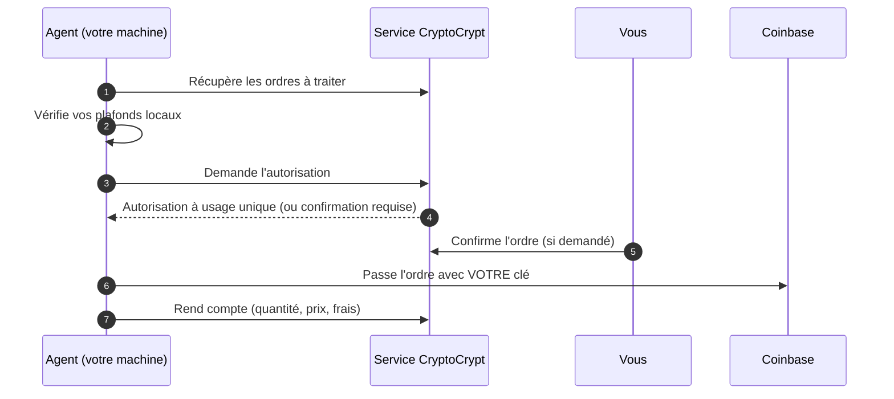

<div align="center">

# CryptoCrypt Agent

**L'exécuteur local, ouvert et vérifiable, de vos ordres CryptoCrypt.**
Votre clé reste chez vous. Chaque ordre est autorisé, plafonné et tracé.

[](https://github.com/shineminder/agent-auto-market/releases)
[](https://github.com/shineminder/agent-auto-market/actions)
[](LICENSE)


[Installer](#-installation) · [Sécurité](#-sécurité) · [Mises à jour](#-mises-à-jour) · [Vérifier une release](#-vérifier-une-release) · [Signaler une faille](SECURITY.md)

</div>

> [!IMPORTANT]
> L'agent **ne prend aucune décision d'investissement**. Il exécute uniquement des ordres que le service a autorisés, dans les plafonds que **vous** fixez sur **votre** machine, avec **votre** clé Coinbase, qui ne quitte jamais votre appareil.

## Sommaire

- [En bref](#-en-bref)
- [Comment ça marche](#-comment-ça-marche)
- [Installation](#-installation)
- [Commandes](#-commandes)
- [Plafonds locaux](#-plafonds-locaux)
- [Mises à jour](#-mises-à-jour)
- [Sécurité](#-sécurité)
- [Vérifier une release](#-vérifier-une-release)
- [Compiler depuis les sources](#-compiler-depuis-les-sources)
- [Désinstaller](#-désinstaller)
- [FAQ](#-faq)
- [Normes et références](#-normes-et-références)

## ✨ En bref

| | |
|---|---|
| 🔑 **Votre clé reste chez vous** | Chiffrée sur votre machine, jamais envoyée au service. |
| 🧱 **Double verrou** | Le service autorise chaque ordre ; l'agent refuse en plus tout ce qui dépasse **vos** plafonds locaux. |
| 🙋 **Vous gardez la main** | Confirmation des ordres sur le site si vous l'avez demandée ; révocation immédiate depuis « Mes accès ». |
| 📤 **Connexions sortantes uniquement** | Aucun port ouvert, fonctionne derrière n'importe quelle box ou pare-feu. |
| ✍️ **Releases signées** | Chaque version est signée et vérifiée avant installation, y compris lors des mises à jour automatiques. |
| 🔍 **Code ouvert** | Tout ce que fait l'agent est lisible ici. Aucune télémétrie cachée. |

## ⚙️ Comment ça marche



- En **simulation**, l'agent ne passe aucun ordre : il note ce qui aurait été fait.
- Une autorisation ne sert **qu'une fois**, pendant quelques minutes, et pour le montant autorisé.

## 🚀 Installation

### Avant de commencer (5 minutes)

1. **Créez une clé d'API Coinbase** (Paramètres › API) :
   - droits : **Consulter** et **Négocier** uniquement, **jamais Transférer** ;
   - algorithme : **ECDSA** (ES256) ;
   - sur un serveur (VPS), limitez la clé à **l'adresse IP du serveur** ;
   - téléchargez le fichier `cdp_api_key.json`.
2. **Générez un code d'appairage** sur le site, page **Mes accès**. Il est valable **10 minutes**.

### 🪟 Windows 10 / 11

Ouvrez **PowerShell** et collez (remplacez le code et, si besoin, le chemin du fichier) :

```powershell
irm https://github.com/shineminder/agent-auto-market/releases/latest/download/install.ps1 -OutFile $env:TEMP\cc-install.ps1; powershell -ExecutionPolicy Bypass -File $env:TEMP\cc-install.ps1 -Code ABCD-EFGH -CleCoinbase "$env:USERPROFILE\Downloads\cdp_api_key.json" -SupprimerFichierCle
```

Windows demande une seule fois l'autorisation administrateur. L'agent est installé comme **service** et démarre avec Windows.

### 🐧 Linux (PC ou serveur)

```bash
curl -fsSL https://github.com/shineminder/agent-auto-market/releases/latest/download/install.sh | sudo bash -s -- --code ABCD-EFGH --key ~/cdp_api_key.json
```

Debian, Ubuntu, Fedora, RHEL et dérivés, en x64 et ARM64. L'agent est installé comme service **systemd**.

### ☁️ Serveur en un clic (cloud-init)

À coller dans le champ « user data » lors de la création d'un serveur Linux **à votre nom** :

```yaml
#cloud-config
runcmd:
  - curl -fsSL https://github.com/shineminder/agent-auto-market/releases/latest/download/install.sh -o /root/cc-install.sh
  - bash /root/cc-install.sh --code ABCD-EFGH --os-updates
```

Puis ajoutez la clé Coinbase **après** le démarrage, par SSH (jamais dans « user data », que l'hébergeur conserve) :

```bash
sudo bash /root/cc-install.sh --key /chemin/vers/cdp_api_key.json && shred -u /chemin/vers/cdp_api_key.json
```

> [!TIP]
> `--os-updates` active les mises à jour de sécurité automatiques du système (Debian/Ubuntu). Recommandé sur un serveur dédié à l'agent.

## 🧭 Commandes

Sous Windows : `cc-agent` (dans `C:\Program Files\CryptoCryptAgent`), en administrateur. Sous Linux : `sudo -u ccagent cc-agent`.

| Commande | Effet |
|---|---|
| `cc-agent status` | État : appairage, clé, plafonds, ordres en cours, version cible. |
| `cc-agent verify` | Contrôle complet : serveur joint, clé acceptée par Coinbase. |
| `cc-agent limits --order 100 --month 500` | Modifie vos plafonds locaux (en USD). |
| `cc-agent limits --assets BTC,ETH` | Actifs autorisés sur cette machine. |
| `cc-agent limits --auto-update false` | Désactive les mises à jour automatiques. |
| `cc-agent update` | Installe la version demandée par le service (si plus récente et signée). |
| `cc-agent pair --code XXXX-XXXX --server https://gaplab.fr` | Réappaire la machine. |
| `cc-agent key --file cdp_api_key.json` | Remplace la clé Coinbase (vérifiée avant enregistrement). |
| `cc-agent version` · `cc-agent help` | Version · aide. |

## 🧱 Plafonds locaux

Fixés sur **votre** machine et appliqués **avant** toute demande au service :

- **montant maximal par ordre** (100 USD par défaut) ;
- **montant maximal par mois** (500 USD par défaut) ;
- **actifs autorisés** : fixés au premier contact, modifiables uniquement en local.

Même un service compromis ne peut pas les dépasser.

## 🔄 Mises à jour

- L'administrateur du service peut demander une version à **tous** les agents ou à **un seul** (pour valider un correctif avant de le généraliser).
- L'agent télécharge la version **uniquement depuis les releases de ce dépôt**, vérifie la **signature** puis l'**empreinte**, remplace son exécutable et redémarre.
- Il n'installe **jamais une version plus ancienne** de lui-même : un retour en arrière exige `cc-agent update --version X.Y.Z --allow-downgrade` sur la machine.
- Vous pouvez tout désactiver : `cc-agent limits --auto-update false`.

L'agent ne met pas à jour votre système d'exploitation. Le service affiche la version du système déclarée par l'agent, pour repérer les machines à mettre à jour.

## 🔒 Sécurité

| Sujet | Mesure |
|---|---|
| Clé Coinbase | Windows : chiffrée par la protection des données Windows, dossier réservé au compte du service. Linux : fichier `0600` du seul utilisateur `ccagent`. Jamais journalisée, jamais transmise. |
| Privilèges | Windows : compte de service virtuel `NT SERVICE\CryptoCryptAgent`. Linux : utilisateur système sans shell, service systemd durci (`NoNewPrivileges`, `ProtectSystem=strict`, `PrivateTmp`...). |
| Réseau | Connexions **sortantes** uniquement, en HTTPS : le service CryptoCrypt, `api.coinbase.com`, `github.com` (mises à jour). |
| Autorisation | Chaque ordre exige une autorisation à usage unique ; l'exécution est comparée à l'autorisation (action, actif, montant). |
| Reprise après incident | Un ordre dont l'issue est inconnue n'est **jamais** renvoyé automatiquement : pas de double achat. |
| Chaîne de publication | Releases signées (ECDSA P-256), empreintes SHA-256, attestation de provenance GitHub. |

**Données envoyées au service** : version de l'agent, description du système (ex. `Microsoft Windows 10.0.22631 (X64)`), nom de la machine à l'appairage, résultats des ordres (quantité, prix, frais). **Rien d'autre.**

Une faille ? Voir [SECURITY.md](SECURITY.md). **N'ouvrez pas de ticket public.**

## ✅ Vérifier une release

```bash
curl -fsSLO https://github.com/shineminder/agent-auto-market/releases/download/vX.Y.Z/SHA256SUMS
curl -fsSLO https://github.com/shineminder/agent-auto-market/releases/download/vX.Y.Z/SHA256SUMS.sig
openssl dgst -sha256 -verify keys/release-public.pem -signature SHA256SUMS.sig SHA256SUMS
sha256sum --ignore-missing -c SHA256SUMS
gh attestation verify cc-agent-linux-x64 --repo shineminder/agent-auto-market
```

## 🛠️ Compiler depuis les sources

Prérequis : [.NET 10 SDK](https://dotnet.microsoft.com/download). Pour la compilation native : Visual Studio Build Tools (C++) sous Windows, `clang` et `zlib1g-dev` sous Linux.

```bash
dotnet publish src/Agent/Agent.csproj -c Release -r linux-x64 -o out   # ou win-x64
```

## 🗑️ Désinstaller

- Windows : `install\uninstall.ps1` (en administrateur).
- Linux : `sudo bash install/uninstall.sh`.

Pensez aussi à **révoquer l'appareil** sur le site (Mes accès) et à **supprimer la clé** chez Coinbase.

## ❓ FAQ

<details><summary><b>L'agent peut-il retirer mes fonds ?</b></summary>

Non. Il n'appelle que la consultation des comptes et le passage d'ordres. Créez la clé **sans** le droit « Transférer » : même volée, elle ne pourrait pas retirer de fonds.
</details>

<details><summary><b>Mon ordinateur doit-il rester allumé ?</b></summary>

Oui, pour que l'agent traite les ordres. Un ordre non traité expire. Pour un agent toujours actif, installez-le sur un petit serveur Linux.
</details>

<details><summary><b>Que se passe-t-il si le service CryptoCrypt est piraté ?</b></summary>

Il ne peut ni obtenir votre clé, ni dépasser vos plafonds locaux, ni installer un agent non signé. Vous pouvez révoquer l'appareil et arrêter le service à tout moment.
</details>

<details><summary><b>Mon antivirus bloque l'exécutable.</b></summary>

Vérifiez la release (section ci-dessus). Si l'empreinte et la signature sont correctes, signalez un faux positif à votre éditeur d'antivirus et ouvrez un ticket ici.
</details>

## 📐 Normes et références

Le projet s'aligne sur : [NIST SSDF (SP 800-218)](https://csrc.nist.gov/pubs/sp/800/218/final) pour le développement, [SLSA](https://slsa.dev) pour la provenance des builds, [OWASP ASVS](https://owasp.org/www-project-application-security-verification-standard/) pour l'API, et les recommandations [OpenSSF](https://openssf.org). Il ne revendique aucune certification.

## 🤝 Contribuer

Voir [CONTRIBUTING.md](CONTRIBUTING.md). Contrat de l'API : [docs/API.md](docs/API.md).

## 📄 Licence

[MIT](LICENSE)
